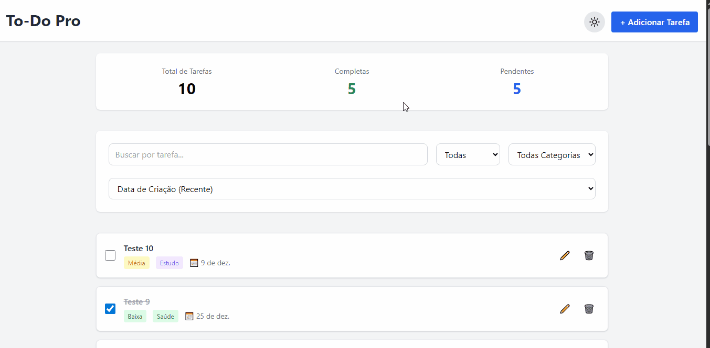

# 📝To-Do list Pro
To-Do List Pro é um gerenciador de tarefas moderno e completo, desenvolvido com foco em produtividade e experiência do usuário. O projeto oferece uma interface intuitiva com modo escuro, permitindo que você organize suas tarefas de forma eficiente através de categorias, prioridades e filtros avançados.

---
## 📸Demonstração


---

## ✨ Funcionalidades

### 🎯 Gerenciamento de Tarefas
-  **Adicionar tarefas** com título, descrição, prioridade, categoria e data de vencimento
-  **Editar tarefas** existentes
-  **Marcar como concluída/pendente**
-  **Excluir tarefas**

### 🔍 Filtros e Organização
-  **Busca por texto** em tempo real
-  **Filtro por status** (Todas, Completas, Pendentes)
-  **Filtro por categoria** (Trabalho, Pessoal, Estudo, Saúde, Finança)
-  **Ordenação** por data de criação, vencimento ou prioridade

### 📊 Estatísticas
-  **Dashboard** com total de tarefas, completas e pendentes
-  Atualização automática dos contadores

### 🌓 Modo Escuro
-  **Dark Mode** com alternância 
-  **Persistência** da preferência do usuário no localStorage
-  Interface otimizada para ambos os modos

### 💾 Importação e Exportação
- **Exportar** todas as tarefas em formato JSON
- **Importar** tarefas de arquivo JSON
- Validação e tratamento de erros

### 🔄 Persistência de Dados
- **LocalStorage** para salvar tarefas automaticamente
- Dados persistem mesmo após fechar o navegador

---
## 🛠️ Tecnologias Utilizadas

- **HTML5** - Estrutura semântica
- **CSS3** - Estilização via Tailwind CSS
- **JavaScript (ES6+)** - Lógica e interatividade
- **Tailwind CSS (CDN)** - Framework CSS utilitário
- **LocalStorage API** - Persistência de dados
- **FileReader API** - Leitura de arquivos JSON
- **Blob API** - Exportação de arquivos

---
## 🚀 Como Usar
Você pode acessar a versão online aqui:
[Demonstração Online](https://devrodrigobrito.github.io/to-do-list-pro/)  
Ou, se preferir rodar localmente em sua máquina:


1. Clone o repositório:
```bash
git https://github.com/devrodrigobrito/to-do-list-pro.git
```

2. Navegue até a pasta do projeto:
```bash
cd to-do-list-pro
```

3. Abra o arquivo `index.html` no seu navegador:
```bash
# No Windows
start index.html

# No Mac
open index.html

# No Linux
xdg-open index.html
```

Ou simplesmente arraste o arquivo `index.html` para o navegador.
> **Nota:** Não é necessário instalar dependências, pois o projeto utiliza CDN do Tailwind CSS.

---
## 📚 Aprendizados
Durante o desenvolvimento deste projeto, foram consolidados os seguintes conhecimentos:

### 🎓 Conceitos Técnicos
- Manipulação avançada do **DOM**
- Uso de **LocalStorage** para persistência de dados
- Implementação de **Dark Mode** com Tailwind CSS
- Trabalho com **FileReader API** e **Blob API**
- **Event Handling** e **Event Delegation**
- Tratamento de erros com **try-catch**

### 🎨 Design e UX
- Princípios de **UI/UX Design**
- **Responsividade** com Tailwind CSS
- **Feedback visual** ao usuário
- Validação de formulários

### 💻 Boas Práticas
- Código **limpo e organizado**
- Funções **reutilizáveis** e **modulares**
- **Nomenclatura semântica** de variáveis
- **Comentários** estratégicos no código
- **Validação** e tratamento de dados

### 🔧 Ferramentas
- Uso eficiente do **Tailwind CSS**
- **Git** e versionamento de código

---

## 👨‍💻 Autor

**Rodrigo Brito**

- GitHub: [@devrodrigobrito](https://github.com/devrodrigobrito)
- LinkedIn: [@devrodrigobrito](www.linkedin.com/in/devrodrigobrito)
- E-mail: rodrigobritocontato@gmail.com

